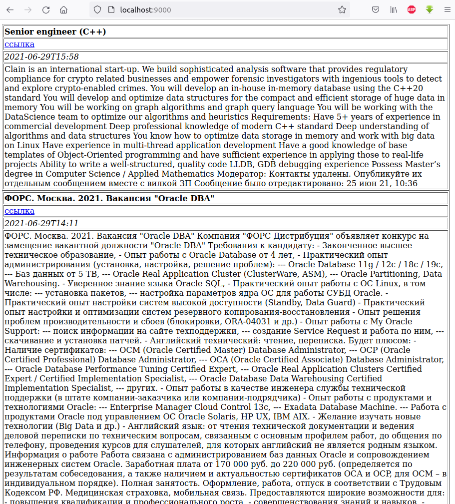

# Приложение job4j_grabber

## О проекте
#### Описание
Приложение позволяет осуществлять периодический парсинг сайта sql.ru, сохранять 
данные о вакансиях в PostgreSQL-базу и выводить их в HTML-формате пользователю.

#### Технологии
>JDK14, Maven, PostgreSQL, JDBC, Junit, JSOUP, Quartz

## Сборка
0. Скачайте исходники
1. Создайте базу данных в соответствии с настройками, указанными в файле *src/main/resources/rabbit.properties*. 
   Также в этом файле задается адрес страницы для парсинга и расписание работы скрипта
2. Осуществите сборку приложения: `mvn clean install`
3. Запустите из консоли командой: `java -jar target/job4j_grabber-1.0-SNAPSHOT.jar`

## Как использовать
После запуска скрипта и успешного парсинга, данные поступят в базу данных. Результаты работы можно увидеть по адресу:
`http://localhost:9000`

## Контакты
email:tribuna87@mail.ru
telegram: @kutiavinvladimir
Vladimir Kutyavin
